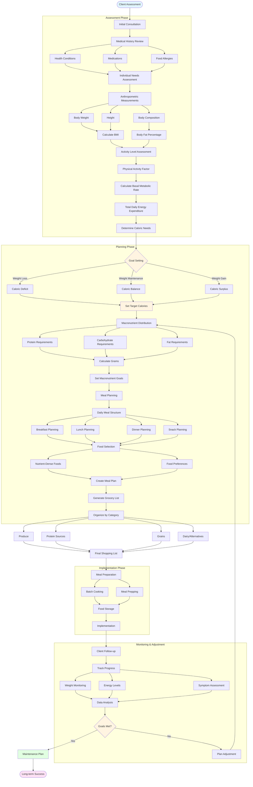

```mermaid
flowchart TD
    Start([Client Assessment]) --> A[Initial Consultation]
    A --> B[Medical History Review]
    B --> C[Health Conditions]
    B --> D[Medications]
    B --> E[Food Allergies]
    C --> F[Individual Needs Assessment]
    D --> F
    E --> F
    F --> G[Anthropometric Measurements]
    G --> H[Body Weight]
    G --> I[Height]
    G --> J[Body Composition]
    H --> K[Calculate BMI]
    I --> K
    J --> L[Body Fat Percentage]
    K --> M[Activity Level Assessment]
    L --> M
    M --> N[Physical Activity Factor]
    N --> O[Calculate Basal Metabolic Rate]
    O --> P[Total Daily Energy Expenditure]
    P --> Q[Determine Caloric Needs]
    Q --> R{Goal Setting}
    R -->|Weight Loss| S[Caloric Deficit]
    R -->|Weight Maintenance| T[Caloric Balance]
    R -->|Weight Gain| U[Caloric Surplus]
    S --> V[Set Target Calories]
    T --> V
    U --> V
    V --> W[Macronutrient Distribution]
    W --> X[Protein Requirements]
    W --> Y[Carbohydrate Requirements]
    W --> Z[Fat Requirements]
    X --> AA[Calculate Grams]
    Y --> AA
    Z --> AA
    AA --> AB[Set Macronutrient Goals]
    AB --> AC[Meal Planning]
    AC --> AD[Daily Meal Structure]
    AD --> AE[Breakfast Planning]
    AD --> AF[Lunch Planning]
    AD --> AG[Dinner Planning]
    AD --> AH[Snack Planning]
    AE --> AI[Food Selection]
    AF --> AI
    AG --> AI
    AH --> AI
    AI --> AJ[Nutrient-Dense Foods]
    AI --> AK[Food Preferences]
    AJ --> AL[Create Meal Plan]
    AK --> AL
    AL --> AM[Generate Grocery List]
    AM --> AN[Organize by Category]
    AN --> AO[Produce]
    AN --> AP[Protein Sources]
    AN --> AQ[Grains]
    AN --> AR[Dairy/Alternatives]
    AO --> AS[Final Shopping List]
    AP --> AS
    AQ --> AS
    AR --> AS
    AS --> AT[Meal Preparation]
    AT --> AU[Batch Cooking]
    AT --> AV[Meal Prepping]
    AU --> AW[Food Storage]
    AV --> AW
    AW --> AX[Implementation]
    AX --> AY[Client Follow-up]
    AY --> AZ[Track Progress]
    AZ --> BA[Weight Monitoring]
    AZ --> BB[Energy Levels]
    AZ --> BC[Symptom Assessment]
    BA --> BD[Data Analysis]
    BB --> BD
    BC --> BD
    BD --> BE{Goals Met?}
    BE -->|Yes| BF[Maintenance Plan]
    BE -->|No| BG[Plan Adjustment]
    BG --> W
    BF --> End([Long-term Success])
    
    subgraph Assessment_Phase["Assessment Phase"]
        A
        B
        C
        D
        E
        F
        G
        H
        I
        J
        K
        L
        M
        N
        O
        P
        Q
    end
    
    subgraph Planning_Phase["Planning Phase"]
        R
        S
        T
        U
        V
        W
        X
        Y
        Z
        AA
        AB
        AC
        AD
        AE
        AF
        AG
        AH
        AI
        AJ
        AK
        AL
        AM
        AN
    end
    
    subgraph Implementation_Phase["Implementation Phase"]
        AT
        AU
        AV
        AW
        AX
    end
    
    subgraph Monitoring_Phase["Monitoring & Adjustment"]
        AY
        AZ
        BA
        BB
        BC
        BD
        BE
        BG
    end
    
    style Start fill:#e1f5ff
    style End fill:#ffe1f5
    style R fill:#fff4e1
    style BE fill:#fff4e1
    style BF fill:#e1ffe1
    style V fill:#fff4e1
```
