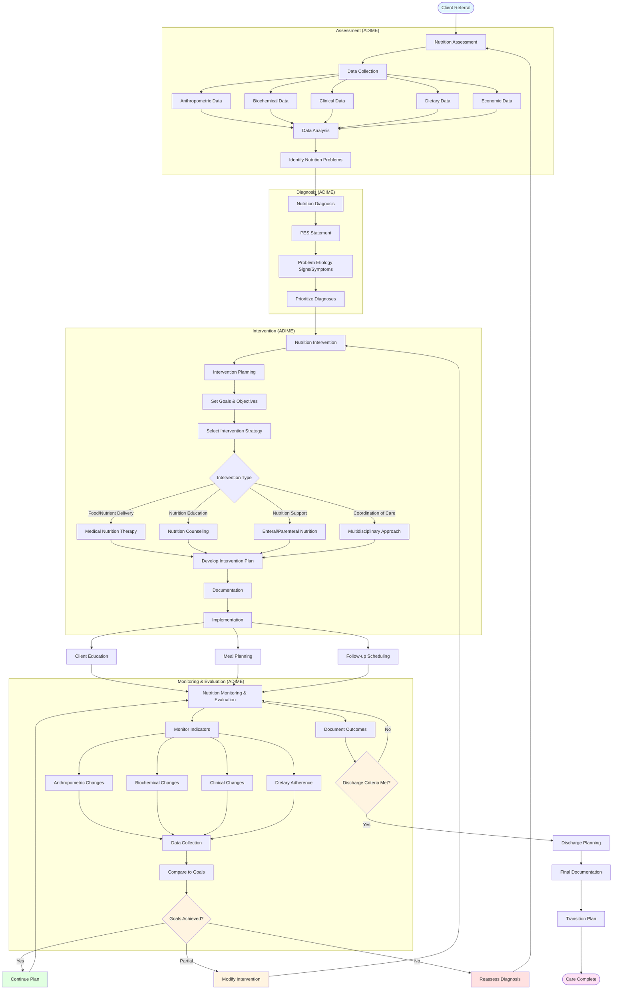

```mermaid
flowchart TD
    Start([Client Referral]) --> A[Nutrition Assessment]
    A --> B[Data Collection]
    B --> C[Anthropometric Data]
    B --> D[Biochemical Data]
    B --> E[Clinical Data]
    B --> F[Dietary Data]
    B --> G[Economic Data]
    C --> H[Data Analysis]
    D --> H
    E --> H
    F --> H
    G --> H
    H --> I[Identify Nutrition Problems]
    I --> J[Nutrition Diagnosis]
    J --> K[PES Statement]
    K --> L[Problem Etiology Signs/Symptoms]
    L --> M[Prioritize Diagnoses]
    M --> N[Nutrition Intervention]
    N --> O[Intervention Planning]
    O --> P[Set Goals & Objectives]
    P --> Q[Select Intervention Strategy]
    Q --> R{Intervention Type}
    R -->|Food/Nutrient Delivery| S[Medical Nutrition Therapy]
    R -->|Nutrition Education| T[Nutrition Counseling]
    R -->|Nutrition Support| U[Enteral/Parenteral Nutrition]
    R -->|Coordination of Care| V[Multidisciplinary Approach]
    S --> W[Develop Intervention Plan]
    T --> W
    U --> W
    V --> W
    W --> X[Documentation]
    X --> Y[Implementation]
    Y --> Z[Client Education]
    Y --> AA[Meal Planning]
    Y --> AB[Follow-up Scheduling]
    Z --> AC[Nutrition Monitoring & Evaluation]
    AA --> AC
    AB --> AC
    AC --> AD[Monitor Indicators]
    AD --> AE[Anthropometric Changes]
    AD --> AF[Biochemical Changes]
    AD --> AG[Clinical Changes]
    AD --> AH[Dietary Adherence]
    AE --> AI[Data Collection]
    AF --> AI
    AG --> AI
    AH --> AI
    AI --> AJ[Compare to Goals]
    AJ --> AK{Goals Achieved?}
    AK -->|Yes| AL[Continue Plan]
    AK -->|Partial| AM[Modify Intervention]
    AK -->|No| AN[Reassess Diagnosis]
    AL --> AC
    AM --> N
    AN --> A
    AC --> AO[Document Outcomes]
    AO --> AP{Discharge Criteria Met?}
    AP -->|Yes| AQ[Discharge Planning]
    AP -->|No| AC
    AQ --> AR[Final Documentation]
    AR --> AS[Transition Plan]
    AS --> End([Care Complete])
    
    subgraph Assessment["Assessment (ADIME)"]
        A
        B
        C
        D
        E
        F
        G
        H
        I
    end
    
    subgraph Diagnosis["Diagnosis (ADIME)"]
        J
        K
        L
        M
    end
    
    subgraph Intervention["Intervention (ADIME)"]
        N
        O
        P
        Q
        R
        S
        T
        U
        V
        W
        X
        Y
    end
    
    subgraph Monitoring_Evaluation["Monitoring & Evaluation (ADIME)"]
        AC
        AD
        AE
        AF
        AG
        AH
        AI
        AJ
        AK
        AO
        AP
    end
    
    style Start fill:#e1f5ff
    style End fill:#ffe1f5
    style AK fill:#fff4e1
    style AP fill:#fff4e1
    style AL fill:#e1ffe1
    style AM fill:#fff4e1
    style AN fill:#ffe1e1
```
