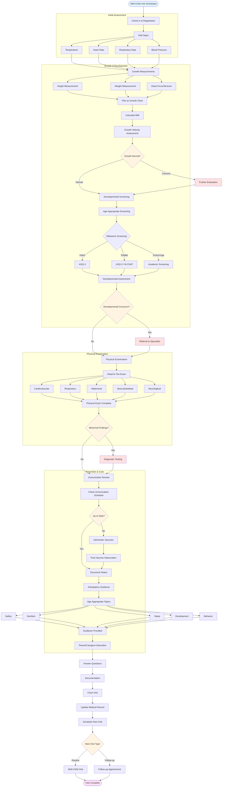

```mermaid
flowchart TD
    Start([Well-Child Visit Scheduled]) --> A[Check-in & Registration]
    A --> B[Vital Signs]
    B --> C[Temperature]
    B --> D[Heart Rate]
    B --> E[Respiratory Rate]
    B --> F[Blood Pressure]
    C --> G[Growth Measurements]
    D --> G
    E --> G
    F --> G
    G --> H[Height Measurement]
    G --> I[Weight Measurement]
    G --> J[Head Circumference]
    H --> K[Plot on Growth Chart]
    I --> K
    J --> K
    K --> L[Calculate BMI]
    L --> M[Growth Velocity Assessment]
    M --> N{Growth Normal?}
    N -->|Concern| O[Further Evaluation]
    N -->|Normal| P[Developmental Screening]
    O --> P
    P --> Q[Age-Appropriate Screening]
    Q --> R{Milestone Screening}
    R -->|Infant| S[ASQ-3]
    R -->|Toddler| T[ASQ-3 / M-CHAT]
    R -->|School Age| U[Academic Screening]
    S --> V[Developmental Assessment]
    T --> V
    U --> V
    V --> W{Developmental Concerns?}
    W -->|Yes| X[Referral to Specialist]
    W -->|No| Y[Physical Examination]
    X --> Y
    Y --> Z[Head-to-Toe Exam]
    Z --> AA[Cardiovascular]
    Z --> AB[Respiratory]
    Z --> AC[Abdominal]
    Z --> AD[Musculoskeletal]
    Z --> AE[Neurological]
    AA --> AF[Physical Exam Complete]
    AB --> AF
    AC --> AF
    AD --> AF
    AE --> AF
    AF --> AG{Abnormal Findings?}
    AG -->|Yes| AH[Diagnostic Testing]
    AG -->|No| AI[Immunization Review]
    AH --> AI
    AI --> AJ[Check Immunization Schedule]
    AJ --> AK{Up to Date?}
    AK -->|No| AL[Administer Vaccines]
    AK -->|Yes| AM[Document Status]
    AL --> AN[Post-Vaccine Observation]
    AN --> AM
    AM --> AO[Anticipatory Guidance]
    AO --> AP[Age-Appropriate Topics]
    AP --> AQ[Safety]
    AP --> AR[Nutrition]
    AP --> AS[Sleep]
    AP --> AT[Development]
    AP --> AU[Behavior]
    AQ --> AV[Guidance Provided]
    AR --> AV
    AS --> AV
    AT --> AV
    AU --> AV
    AV --> AW[Parent/Caregiver Education]
    AW --> AX[Answer Questions]
    AX --> AY[Documentation]
    AY --> AZ[Chart Visit]
    AZ --> BA[Update Medical Record]
    BA --> BB[Schedule Next Visit]
    BB --> BC{Next Visit Type}
    BC -->|Routine| BD[Well-Child Visit]
    BC -->|Follow-up| BE[Follow-up Appointment]
    BD --> End([Visit Complete])
    BE --> End
    
    subgraph Initial_Assessment["Initial Assessment"]
        A
        B
        C
        D
        E
        F
    end
    
    subgraph Growth_Development["Growth & Development"]
        G
        H
        I
        J
        K
        L
        M
        N
        P
        Q
        R
        S
        T
        U
        V
        W
    end
    
    subgraph Physical_Exam["Physical Examination"]
        Y
        Z
        AA
        AB
        AC
        AD
        AE
        AF
        AG
    end
    
    subgraph Prevention_Care["Prevention & Care"]
        AI
        AJ
        AK
        AL
        AM
        AN
        AO
        AP
        AV
        AW
    end
    
    style Start fill:#e1f5ff
    style End fill:#ffe1f5
    style N fill:#fff4e1
    style W fill:#fff4e1
    style AG fill:#fff4e1
    style AK fill:#fff4e1
    style BC fill:#fff4e1
    style O fill:#ffe1e1
    style X fill:#ffe1e1
    style AH fill:#ffe1e1
```
