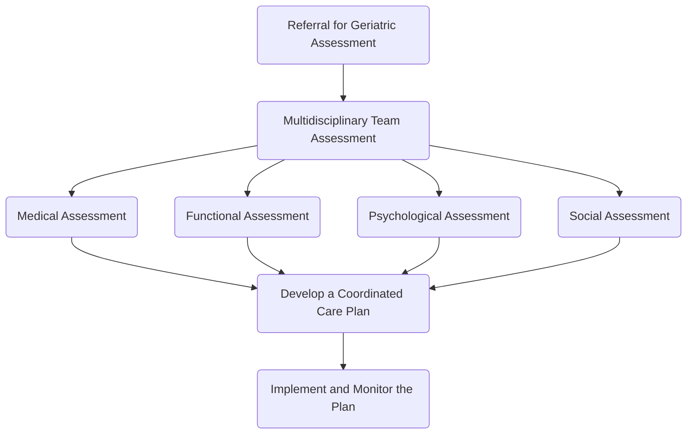

```mermaid
flowchart TD
    A(Referral for Geriatric Assessment) --> B(Multidisciplinary Team Assessment);
    B --> C(Medical Assessment);
    B --> D(Functional Assessment);
    B --> E(Psychological Assessment);
    B --> F(Social Assessment);
    C & D & E & F --> G(Develop a Coordinated Care Plan);
    G --> H(Implement and Monitor the Plan);
```
