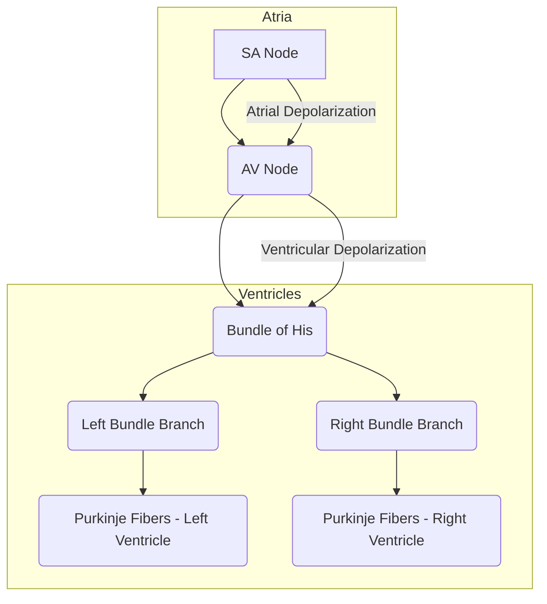

```mermaid
flowchart TD
    A[SA Node] --> B(AV Node);
    B --> C(Bundle of His);
    C --> D(Left Bundle Branch);
    C --> E(Right Bundle Branch);
    D --> F(Purkinje Fibers - Left Ventricle);
    E --> G(Purkinje Fibers - Right Ventricle);

    subgraph Atria
        A; B;
    end

    subgraph Ventricles
        C; D; E; F; G;
    end

    A -- Atrial Depolarization --> B;
    B -- Ventricular Depolarization --> C;
```
