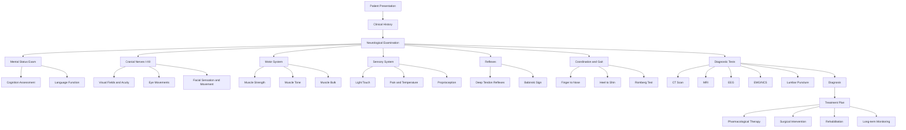

```mermaid
flowchart TD
    Start[Patient Presentation] --> History[Clinical History]
    History --> Exam[Neurological Examination]
    Exam --> MentalStatus[Mental Status Exam]
    Exam --> CranialNerves[Cranial Nerves I-XII]
    Exam --> Motor[Motor System]
    Exam --> Sensory[Sensory System]
    Exam --> Reflexes[Reflexes]
    Exam --> Coordination[Coordination and Gait]
    MentalStatus --> Cognition[Cognition Assessment]
    MentalStatus --> Language[Language Function]
    CranialNerves --> Vision[Visual Fields and Acuity]
    CranialNerves --> EyeMovement[Eye Movements]
    CranialNerves --> Facial[Facial Sensation and Movement]
    Motor --> Strength[Muscle Strength]
    Motor --> Tone[Muscle Tone]
    Motor --> Bulk[Muscle Bulk]
    Sensory --> Touch[Light Touch]
    Sensory --> Pain[Pain and Temperature]
    Sensory --> Proprioception[Proprioception]
    Reflexes --> DeepTendon[Deep Tendon Reflexes]
    Reflexes --> Babinski[Babinski Sign]
    Coordination --> FingerNose[Finger to Nose]
    Coordination --> HeelShin[Heel to Shin]
    Coordination --> Romberg[Romberg Test]
    Exam --> Diagnostics[Diagnostic Tests]
    Diagnostics --> CT[CT Scan]
    Diagnostics --> MRI[MRI]
    Diagnostics --> EEG[EEG]
    Diagnostics --> EMG[EMG/NCS]
    Diagnostics --> LumbarPuncture[Lumbar Puncture]
    Diagnostics --> Diagnosis[Diagnosis]
    Diagnosis --> Treatment[Treatment Plan]
    Treatment --> Medications[Pharmacological Therapy]
    Treatment --> Surgery[Surgical Intervention]
    Treatment --> Rehabilitation[Rehabilitation]
    Treatment --> Monitoring[Long-term Monitoring]
```