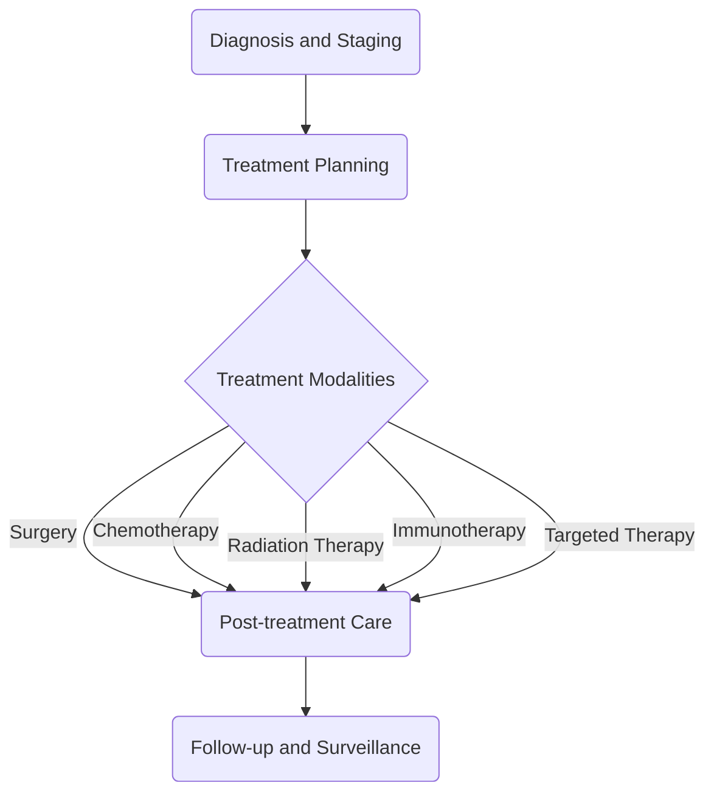

```mermaid
flowchart TD
    A(Diagnosis and Staging) --> B(Treatment Planning);
    B --> C{Treatment Modalities};
    C -- Surgery --> D(Post-treatment Care);
    C -- Chemotherapy --> D;
    C -- Radiation Therapy --> D;
    C -- Immunotherapy --> D;
    C -- Targeted Therapy --> D;
    D --> E(Follow-up and Surveillance);
```
