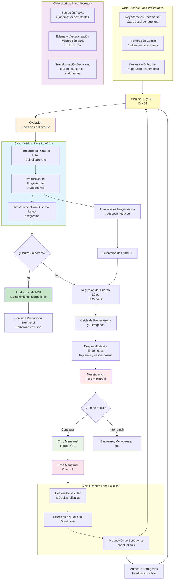

```mermaid
flowchart TD
    A[Ciclo Menstrual<br>Inicio: Día 1] --> B[Fase Menstrual<br>Días 1-5]
    
    B --> C[Fase Folicular<br>Días 1-13]
    
    subgraph C[Ciclo Ovárico: Fase Folicular]
        C1[Desarrollo Folicular<br>Múltiples folículos]
        C1 --> C2[Selección del Folículo Dominante]
        C2 --> C3[Producción de Estrógenos<br>por el folículo]
    end
    
    subgraph D[Ciclo Uterino: Fase Proliferativa]
        D1[Regeneración Endometrial<br>Capa basal se regenera]
        D2[Proliferación Celular<br>Endometrio se engrosa]
        D3[Desarrollo Glándular<br>Preparación endometrial]
    end
    
    C3 --> E[Pico de LH y FSH<br>Día 14]
    D --> E
    
    E --> F[Ovulación<br>Liberación del ovocito]
    
    F --> G[Fase Luteínica<br>Días 15-28]
    
    subgraph G[Ciclo Ovárico: Fase Luteínica]
        G1[Formación del Cuerpo Lúteo<br>Del folículo roto]
        G1 --> G2[Producción de Progesterona<br>y Estrógenos]
        G2 --> G3[Mantenimiento del Cuerpo Lúteo<br>o regresión]
    end
    
    subgraph H[Ciclo Uterino: Fase Secretora]
        H1[Secreción Activa<br>Glándulas endometriales]
        H2[Edema y Vascularización<br>Preparación para implantación]
        H3[Transformación Secretora<br>Máximo desarrollo endometrial]
    end
    
    G3 --> I{¿Ocurre Embarazo?}
    
    I -->|Sí| J[Producción de hCG<br>Mantenimiento cuerpo lúteo]
    I -->|No| K[Regresión del Cuerpo Lúteo<br>Días 24-28]
    
    J --> L[Continúa Producción Hormonal<br>Embarazo en curso]
    K --> M[Caída de Progesterona<br>y Estrógenos]
    
    M --> N[Desprendimiento Endometrial<br>Isquemia y vasoespasmo]
    
    N --> O[Menstruación<br>Flujo menstrual]
    
    O --> P{¿Fin del Ciclo?}
    P -->|Continuar| A
    P -->|Interrumpir| Q[Embarazo, Menopausia, etc.]
    
    %% Regulación Hormonal
    C3 --> R[Aumento Estrógenos<br>Feedback positivo]
    R --> E
    
    G2 --> S[Altos niveles Progesterona<br>Feedback negativo]
    S --> T[Supresión de FSH/LH]
    T --> K
    
    style A fill:#e8f5e8
    style B fill:#fce4ec
    style F fill:#fff3e0
    style G fill:#e1f5fe
    style H fill:#f3e5f5
    style J fill:#c8e6c9
    style O fill:#ffebee
    style E fill:#fff9c4
```
