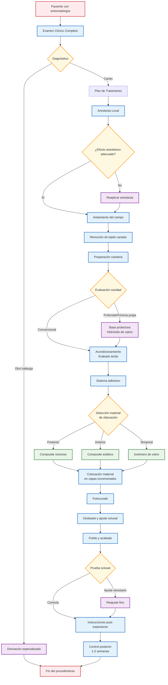

```mermaid
flowchart TD
    Start[Paciente con sintomatología] --> Examen[Examen Clínico Completo]
    
    Examen --> Diagnostico{Diagnóstico}
    Diagnostico -->|Caries| PlanTratamiento[Plan de Tratamiento]
    Diagnostico -->|Otro hallazgo| Derivacion[Derivación especializada]
    
    PlanTratamiento --> Anestesia[Anestesia Local]
    Anestesia --> EfectoAnestesia{¿Efecto anestésico adecuado?}
    EfectoAnestesia -->|No| Reanestesia[Reaplicar anestesia]
    EfectoAnestesia -->|Sí| Aislamiento[Aislamiento del campo]
    
    Reanestesia --> Aislamiento
    
    Aislamiento --> RemoveCaries[Remoción de tejido cariado]
    RemoveCaries --> PrepCavidad[Preparación cavitaria]
    
    PrepCavidad --> EvaluacionCavidad{Evaluación cavidad}
    EvaluacionCavidad -->|Profunda/Próxima pulpa| BaseProtectora[Base protectora<br/>Hidróxido de calcio]
    EvaluacionCavidad -->|Convencional| Acondicionamiento[Acondicionamiento<br/>Grabado ácido]
    
    BaseProtectora --> Acondicionamiento
    Acondicionamiento --> Adhesivo[Sistema adhesivo]
    
    Adhesivo --> SeleccionMaterial{Selección material<br/>de obturación}
    SeleccionMaterial -->|Posterior| CompositePost[Composite resinoso]
    SeleccionMaterial -->|Anterior| CompositeAnt[Composite estético]
    SeleccionMaterial -->|Temporal| Ionomero[Ionómero de vidrio]
    
    CompositePost --> Colocacion[Colocación material<br/>en capas incrementales]
    CompositeAnt --> Colocacion
    Ionomero --> Colocacion
    
    Colocacion --> Fotocurado[Fotocurado]
    Fotocurado --> Desbaste[Desbaste y ajuste oclusal]
    
    Desbaste --> Pulido[Pulido y acabado]
    Pulido --> PruebaOclusal{Prueba oclusal}
    
    PruebaOclusal -->|Ajuste necesario| Reajuste[Reajuste fino]
    PruebaOclusal -->|Correcto| Instrucciones[Instrucciones post-tratamiento]
    
    Reajuste --> Instrucciones
    Instrucciones --> Control[Control posterior<br/>1-2 semanas]
    
    Derivacion --> Fin[Fin del procedimiento]
    Control --> Fin

    classDef startEnd fill:#ffebee,stroke:#c62828,stroke-width:2px
    classDef procedure fill:#e3f2fd,stroke:#1565c0,stroke-width:2px
    classDef decision fill:#fff8e1,stroke:#ff8f00,stroke-width:2px
    classDef material fill:#e8f5e8,stroke:#2e7d32,stroke-width:2px
    classDef special fill:#f3e5f5,stroke:#7b1fa2,stroke-width:2px
    
    class Start,Fin startEnd
    class Examen,Anestesia,Aislamiento,RemoveCaries,PrepCavidad,Acondicionamiento,Adhesivo,Colocacion,Fotocurado,Desbaste,Pulido,Instrucciones,Control procedure
    class Diagnostico,EfectoAnestesia,EvaluacionCavidad,SeleccionMaterial,PruebaOclusal decision
    class CompositePost,CompositeAnt,Ionomero material
    class BaseProtectora,Reanestesia,Reajuste,Derivacion special
```
