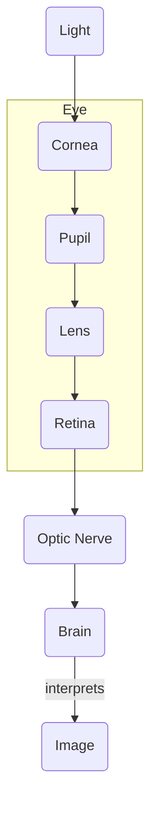

```mermaid
flowchart TD
    A(Light) --> B(Cornea);
    B --> C(Pupil);
    C --> D(Lens);
    D --> E(Retina);
    E --> F(Optic Nerve);
    F --> G(Brain);

    subgraph Eye
        B; C; D; E;
    end

    G -- interprets --> H(Image);
```
