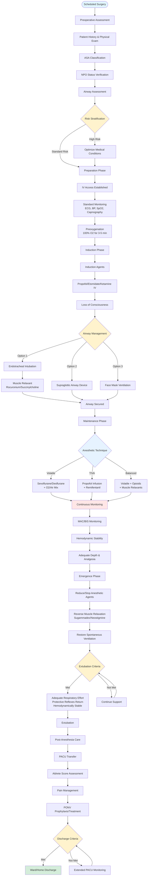

```mermaid
flowchart TD
    Start([Scheduled Surgery]) --> A[Preoperative Assessment]
    
    A --> A1[Patient History & Physical Exam]
    A1 --> A2[ASA Classification]
    A2 --> A3[NPO Status Verification]
    A3 --> A4[Airway Assessment]
    A4 --> A5{Risk Stratification}
    
    A5 -->|High Risk| A6[Optimize Medical Conditions]
    A5 -->|Standard Risk| B[Preparation Phase]
    A6 --> B
    
    B --> B1[IV Access Established]
    B1 --> B2[Standard Monitoring<br/>ECG, BP, SpO2, Capnography]
    B2 --> B3[Preoxygenation<br/>100% O2 for 3-5 min]
    
    B3 --> C[Induction Phase]
    
    C --> C1[Induction Agents]
    C1 --> C2[Propofol/Etomidate/Ketamine IV]
    C2 --> C3[Loss of Consciousness]
    
    C3 --> C4{Airway Management}
    
    C4 -->|Option 1| C5[Endotracheal Intubation]
    C4 -->|Option 2| C6[Supraglottic Airway Device]
    C4 -->|Option 3| C7[Face Mask Ventilation]
    
    C5 --> C8[Muscle Relaxant<br/>Rocuronium/Succinylcholine]
    C8 --> C9[Airway Secured]
    C6 --> C9
    C7 --> C9
    
    C9 --> D[Maintenance Phase]
    
    D --> D1{Anesthetic Technique}
    
    D1 -->|Volatile| D2[Sevoflurane/Desflurane<br/>+ O2/Air Mix]
    D1 -->|TIVA| D3[Propofol Infusion<br/>+ Remifentanil]
    D1 -->|Balanced| D4[Volatile + Opioids<br/>+ Muscle Relaxants]
    
    D2 --> D5[Continuous Monitoring]
    D3 --> D5
    D4 --> D5
    
    D5 --> D6[MAC/BIS Monitoring]
    D6 --> D7[Hemodynamic Stability]
    D7 --> D8[Adequate Depth & Analgesia]
    
    D8 --> E[Emergence Phase]
    
    E --> E1[Reduce/Stop Anesthetic Agents]
    E1 --> E2[Reverse Muscle Relaxation<br/>Sugammadex/Neostigmine]
    E2 --> E3[Restore Spontaneous Ventilation]
    E3 --> E4{Extubation Criteria}
    
    E4 -->|Met| E5[Adequate Respiratory Effort<br/>Protective Reflexes Return<br/>Hemodynamically Stable]
    E4 -->|Not Met| E6[Continue Support]
    E6 --> E4
    
    E5 --> E7[Extubation]
    E7 --> F[Post-Anesthesia Care]
    
    F --> F1[PACU Transfer]
    F1 --> F2[Aldrete Score Assessment]
    F2 --> F3[Pain Management]
    F3 --> F4[PONV Prophylaxis/Treatment]
    F4 --> F5{Discharge Criteria}
    
    F5 -->|Met| F6[Ward/Home Discharge]
    F5 -->|Not Met| F7[Extended PACU Monitoring]
    F7 --> F5
    
    style Start fill:#e1f5ff
    style A5 fill:#fff3cd
    style C4 fill:#fff3cd
    style D1 fill:#e6f3ff
    style E4 fill:#fff3cd
    style F5 fill:#fff3cd
    style F6 fill:#d4edda
    style D5 fill:#ffe6e6
```
