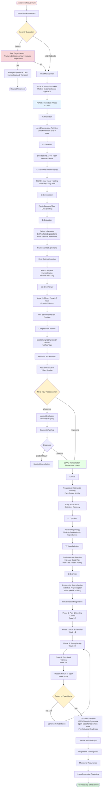

```mermaid
flowchart TD
    Start([Acute Soft Tissue Injury]) --> A[Immediate Assessment]
    
    A --> A1{Severity Evaluation}
    
    A1 -->|Severe| A2[Red Flags Present?<br/>Fracture/Dislocation/Neurovascular Compromise]
    A1 -->|Mild-Moderate| B[Initial Management]
    
    A2 -->|Yes| A3[Emergency Medical Care<br/>Immobilization & Transport]
    A2 -->|No| B
    
    A3 --> End1([Hospital Treatment])
    
    B --> B1[PEACE & LOVE Protocol<br/>Modern Evidence-Based Approach]
    
    B1 --> C[PEACE: Immediate Phase 0-3 days]
    
    C --> C1[P: Protection]
    C1 --> C2[Avoid Aggravating Activities<br/>Limit Movement for 1-3 days]
    
    C2 --> C3[E: Elevation]
    C3 --> C4[Elevate Limb Above Heart<br/>Reduce Edema]
    
    C4 --> C5[A: Avoid Anti-Inflammatories]
    C5 --> C6[NSAIDs May Impair Healing<br/>Especially Long-Term]
    
    C6 --> C7[C: Compression]
    C7 --> C8[Elastic Bandage/Tape<br/>Limit Swelling]
    
    C8 --> C9[E: Education]
    C9 --> C10[Patient Information<br/>Set Realistic Expectations<br/>Avoid Passive Treatments]
    
    C10 --> D[Traditional RICE Elements]
    
    D --> D1[Rest: Optimal Loading]
    D1 --> D2[Avoid Complete Immobilization<br/>Relative Rest Only]
    
    D2 --> D3[Ice: Cryotherapy]
    D3 --> D4[Apply 15-20 min Every 2-3 hours<br/>First 48-72 hours]
    D4 --> D5[Use Barrier to Prevent Frostbite]
    
    D5 --> D6[Compression: Applied]
    D6 --> D7[Elastic Wrap/Compression Garment<br/>Not Too Tight]
    
    D7 --> D8[Elevation: Implemented]
    D8 --> D9[Above Heart Level<br/>When Resting]
    
    D9 --> E{48-72 Hour Reassessment}
    
    E -->|Worsening| E1[Medical Evaluation<br/>Possible Imaging]
    E -->|Improving| F[LOVE: Rehabilitation Phase After 3 days]
    
    E1 --> E2[Diagnostic Workup]
    E2 --> E3{Diagnosis}
    
    E3 -->|Grade III Injury| E4[Surgical Consultation]
    E3 -->|Grade I-II| F
    
    F --> F1[L: Load]
    F1 --> F2[Progressive Mechanical Loading<br/>Pain-Guided Activity]
    F2 --> F3[Early Mobilization Optimizes Recovery]
    
    F3 --> F4[O: Optimism]
    F4 --> F5[Positive Psychology<br/>Realistic but Optimistic Expectations]
    
    F5 --> F6[V: Vascularization]
    F6 --> F7[Cardiovascular Exercise<br/>Increase Blood Flow<br/>Pain-Free Aerobic Activity]
    
    F7 --> F8[E: Exercise]
    F8 --> F9[Progressive Strengthening<br/>Mobility & Proprioception<br/>Sport-Specific Training]
    
    F9 --> G[Rehabilitation Progression]
    
    G --> G1[Phase 1: Pain & Swelling Control<br/>Days 1-7]
    G1 --> G2[Phase 2: ROM & Flexibility<br/>Week 1-2]
    G2 --> G3[Phase 3: Strengthening<br/>Week 2-4]
    G3 --> G4[Phase 4: Functional Training<br/>Week 4-8]
    G4 --> G5[Phase 5: Return to Sport<br/>Week 6-12+]
    
    G5 --> H{Return to Play Criteria}
    
    H -->|Not Met| H1[Continue Rehabilitation]
    H1 --> G3
    
    H -->|Met| H2[Full ROM Achieved<br/>≥90% Strength Symmetry<br/>Sport-Specific Tasks Pain-Free<br/>Psychological Readiness]
    
    H2 --> I[Gradual Return to Sport]
    
    I --> I1[Progressive Training Load]
    I1 --> I2[Monitor for Recurrence]
    I2 --> I3[Injury Prevention Strategies]
    
    I3 --> End2([Full Recovery & Prevention])
    
    style Start fill:#ffe6e6
    style A1 fill:#fff3cd
    style A2 fill:#f8d7da
    style C fill:#e6f3ff
    style F fill:#e6ffe6
    style E fill:#fff3cd
    style H fill:#fff3cd
    style End2 fill:#d4edda
```
