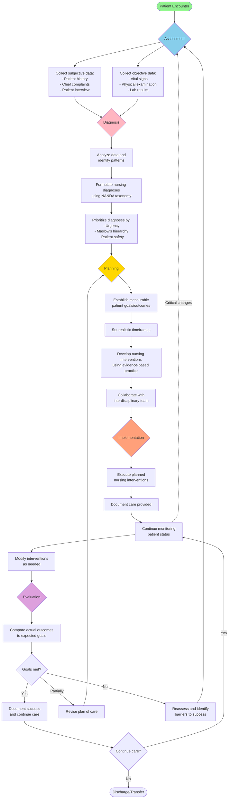

```mermaid
flowchart TD
    Start([Patient Encounter]) --> A{Assessment}
    
    A --> A1[Collect subjective data:<br/>- Patient history<br/>- Chief complaints<br/>- Patient interview]
    A --> A2[Collect objective data:<br/>- Vital signs<br/>- Physical examination<br/>- Lab results]
    
    A1 --> B{Diagnosis}
    A2 --> B
    
    B --> B1[Analyze data and<br/>identify patterns]
    B1 --> B2[Formulate nursing diagnoses<br/>using NANDA taxonomy]
    B2 --> B3[Prioritize diagnoses by:<br/>- Urgency<br/>- Maslow's hierarchy<br/>- Patient safety]
    
    B3 --> C{Planning}
    
    C --> C1[Establish measurable<br/>patient goals/outcomes]
    C1 --> C2[Set realistic timeframes]
    C2 --> C3[Develop nursing interventions<br/>using evidence-based practice]
    C3 --> C4[Collaborate with<br/>interdisciplinary team]
    
    C4 --> D{Implementation}
    
    D --> D1[Execute planned<br/>nursing interventions]
    D1 --> D2[Document care provided]
    D2 --> D3[Continue monitoring<br/>patient status]
    D3 --> D4[Modify interventions<br/>as needed]
    
    D4 --> E{Evaluation}
    
    E --> E1[Compare actual outcomes<br/>to expected goals]
    E1 --> E2{Goals met?}
    
    E2 -->|Yes| E3[Document success<br/>and continue care]
    E2 -->|Partially| E4[Revise plan of care]
    E2 -->|No| E5[Reassess and identify<br/>barriers to success]
    
    E3 --> E6{Continue care?}
    E6 -->|Yes| D3
    E6 -->|No| End([Discharge/Transfer])
    
    E4 --> C
    E5 --> A
    
    D3 -.->|Critical changes| A
    
    style Start fill:#90EE90
    style A fill:#87CEEB
    style B fill:#FFB6C1
    style C fill:#FFD700
    style D fill:#FFA07A
    style E fill:#DDA0DD
```

    style End fill:#90EE90
    style E2 fill:#FF6B6B
