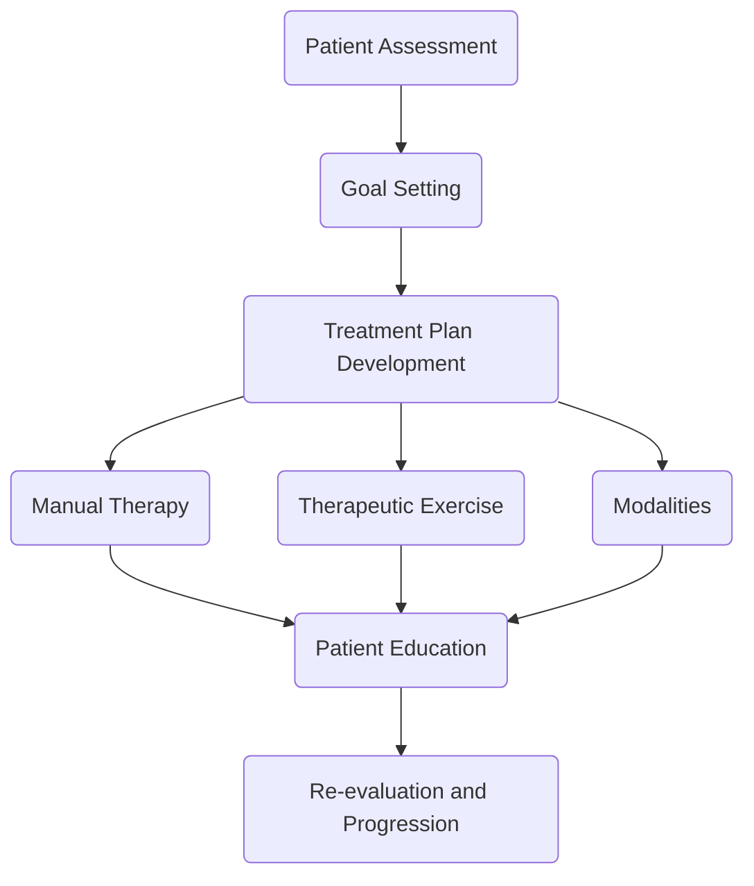

```mermaid
flowchart TD
    A(Patient Assessment) --> B(Goal Setting);
    B --> C(Treatment Plan Development);
    C --> D(Manual Therapy);
    C --> E(Therapeutic Exercise);
    C --> F(Modalities);
    D & E & F --> G(Patient Education);
    G --> H(Re-evaluation and Progression);
```
