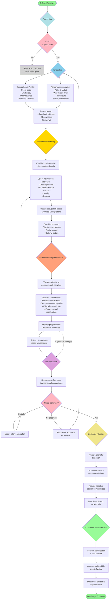

```mermaid
flowchart TD
    Start([Referral Received]) --> A{Screening}
    
    A --> A1{Is OT<br/>appropriate?}
    A1 -->|No| A2[Refer to appropriate<br/>service/discipline]
    A1 -->|Yes| B{Evaluation}
    
    B --> B1[Occupational Profile:<br/>- Client goals<br/>- Life history<br/>- Daily routines<br/>- Interests & values]
    B --> B2[Performance Analysis:<br/>- ADLs & IADLs<br/>- Work/productivity<br/>- Play/leisure<br/>- Social participation]
    
    B1 --> B3[Assess using:<br/>- Standardized tests<br/>- Observations<br/>- Interviews]
    B2 --> B3
    
    B3 --> C{Intervention Planning}
    
    C --> C1[Establish collaborative<br/>client-centered goals]
    C1 --> C2[Select intervention approach:<br/>- Create/promote<br/>- Establish/restore<br/>- Maintain<br/>- Modify<br/>- Prevent]
    C2 --> C3[Design occupation-based<br/>activities & adaptations]
    C3 --> C4[Consider context:<br/>- Physical environment<br/>- Social support<br/>- Cultural factors]
    
    C4 --> D{Intervention Implementation}
    
    D --> D1[Therapeutic use of<br/>occupations & activities]
    D1 --> D2[Types of interventions:<br/>- Remediation/restoration<br/>- Compensation/adaptation<br/>- Education & training<br/>- Environmental modification]
    D2 --> D3[Monitor progress and<br/>document outcomes]
    D3 --> D4[Adjust interventions<br/>based on response]
    
    D4 --> E{Re-evaluation}
    
    E --> E1[Reassess performance<br/>in meaningful occupations]
    E1 --> E2{Goals achieved?}
    
    E2 -->|Partially| E3[Modify intervention plan]
    E2 -->|No progress| E4[Reconsider approach<br/>or barriers]
    E2 -->|Yes| F{Discharge Planning}
    
    E3 --> C2
    E4 --> B
    
    F --> F1[Prepare client for<br/>transition]
    F1 --> F2[Home/community<br/>recommendations]
    F2 --> F3[Provide adaptive<br/>equipment/resources]
    F3 --> F4[Establish follow-up<br/>or referrals]
    
    F4 --> G{Outcomes Measurement}
    
    G --> G1[Measure participation<br/>in occupations]
    G1 --> G2[Assess quality of life<br/>& satisfaction]
    G2 --> G3[Document functional<br/>improvements]
    G3 --> End([Discharge Complete])
    
    D3 -.->|Significant changes| E
    
    style Start fill:#90EE90
    style A fill:#B0E0E6
    style B fill:#87CEEB
    style C fill:#FFD700
    style D fill:#FFA07A
    style E fill:#DDA0DD
    style F fill:#F0E68C
    style G fill:#98FB98
    style End fill:#90EE90
    style A1 fill:#FFB6C1
    style E2 fill:#FFB6C1
    style A2 fill:#D3D3D3
```
