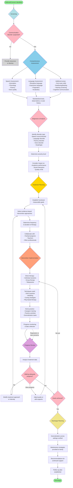

```mermaid
flowchart TD
    Start([Referral/Concern Identified]) --> A{Screening}
    
    A --> A1{Communication<br/>disorder suspected?}
    A1 -->|No| A2[Provide resources<br/>or dismiss]
    A1 -->|Yes| B{Comprehensive Assessment}
    
    B --> B1[Speech Assessment:<br/>- Articulation<br/>- Phonology<br/>- Fluency<br/>- Voice quality]
    B --> B2[Language Assessment:<br/>- Receptive language<br/>- Expressive language<br/>- Pragmatics<br/>- Vocabulary]
    B --> B3[Additional areas:<br/>- Oral motor skills<br/>- Swallowing/feeding<br/>- Hearing screening<br/>- Cognitive-communication]
    
    B1 --> B4[Standardized tests,<br/>observations, & case history]
    B2 --> B4
    B3 --> B4
    
    B4 --> C{Diagnosis & Analysis}
    
    C --> C1[Identify disorder type:<br/>- Speech sound disorder<br/>- Language disorder<br/>- Fluency disorder<br/>- Voice disorder<br/>- Dysphagia]
    C1 --> C2[Determine severity level]
    C2 --> C3[Consider impact on:<br/>- Academic performance<br/>- Social interaction<br/>- Quality of life]
    
    C3 --> D{Treatment Planning}
    
    D --> D1[Establish functional<br/>measurable goals]
    D1 --> D2[Select evidence-based<br/>intervention approaches]
    D2 --> D3[Determine frequency<br/>& duration of therapy]
    D3 --> D4[Collaborate with:<br/>- Family/caregivers<br/>- Teachers<br/>- Other professionals]
    
    D4 --> E{Intervention Implementation}
    
    E --> E1[Direct therapy:<br/>- Individual sessions<br/>- Group therapy<br/>- Telepractice]
    E1 --> E2[Techniques used:<br/>- Drill & practice<br/>- Modeling<br/>- Cueing strategies<br/>- Play-based therapy]
    E2 --> E3[Home practice:<br/>- Caregiver training<br/>- Practice activities<br/>- Generalization tasks]
    E3 --> E4[Progress monitoring<br/>& data collection]
    
    E4 --> F{Progress Review}
    
    F --> F1[Analyze treatment data]
    F1 --> F2{Making adequate<br/>progress?}
    
    F2 -->|No| F3[Modify treatment approach<br/>or intensity]
    F2 -->|Slow progress| F4[Adjust goals or<br/>add supports]
    F2 -->|Yes| G{Goals achieved?}
    
    F3 --> D2
    F4 --> D1
    
    G -->|Not yet| E1
    G -->|Yes| H{Discharge Planning}
    
    H --> H1[Generalization across<br/>settings verified]
    H1 --> H2[Maintenance strategies<br/>provided to family]
    H2 --> H3[Recommendations for<br/>continued support]
    H3 --> H4[Follow-up plan<br/>established]
    
    H4 --> I([Discharge])
    
    E4 -.->|Regression or<br/>new concerns| F
    
    style Start fill:#90EE90
    style A fill:#B0E0E6
    style B fill:#87CEEB
    style C fill:#FFB6C1
    style D fill:#FFD700
    style E fill:#FFA07A
    style F fill:#DDA0DD
    style G fill:#DA70D6
    style H fill:#F0E68C
    style I fill:#90EE90
    style A1 fill:#FFB6C1
    style F2 fill:#FFB6C1
    style G fill:#FFB6C1
    style A2 fill:#D3D3D3
```
