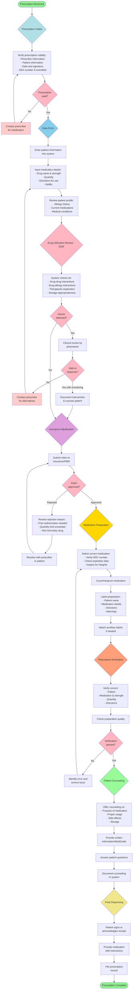

```mermaid
flowchart TD
    Start([Prescription Received]) --> A{Prescription Intake}
    
    A --> A1[Verify prescription validity:<br/>- Prescriber information<br/>- Patient information<br/>- Date and signature<br/>- DEA number if controlled]
    
    A1 --> A2{Prescription<br/>valid?}
    A2 -->|No| A3[Contact prescriber<br/>for clarification]
    A3 --> A1
    A2 -->|Yes| B{Data Entry}
    
    B --> B1[Enter patient information<br/>into system]
    B1 --> B2[Input medication details:<br/>- Drug name & strength<br/>- Quantity<br/>- Directions for use<br/>- Refills]
    B2 --> B3[Review patient profile:<br/>- Allergy history<br/>- Current medications<br/>- Medical conditions]
    
    B3 --> C{Drug Utilization Review - DUR}
    
    C --> C1[System checks for:<br/>- Drug-drug interactions<br/>- Drug-allergy interactions<br/>- Therapeutic duplication<br/>- Dosage appropriateness]
    
    C1 --> C2{Issues<br/>detected?}
    C2 -->|Yes| C3[Clinical review by<br/>pharmacist]
    C3 --> C4{Safe to<br/>dispense?}
    C4 -->|No| C5[Contact prescriber<br/>for alternatives]
    C5 --> B2
    C4 -->|Yes with monitoring| C6[Document intervention<br/>& counsel patient]
    C6 --> D
    C2 -->|No| D{Insurance Adjudication}
    
    D --> D1[Submit claim to<br/>insurance/PBM]
    D1 --> D2{Claim<br/>approved?}
    
    D2 -->|Rejected| D3[Review rejection reason:<br/>- Prior authorization needed<br/>- Quantity limit exceeded<br/>- Non-formulary drug]
    D3 --> D4[Resolve with prescriber<br/>or patient]
    D4 --> D1
    D2 -->|Approved| E{Medication Preparation}
    
    E --> E1[Select correct medication:<br/>- Verify NDC number<br/>- Check expiration date<br/>- Inspect for integrity]
    E1 --> E2[Count/measure medication]
    E2 --> E3[Label preparation:<br/>- Patient name<br/>- Medication details<br/>- Directions<br/>- Warnings]
    E3 --> E4[Attach auxiliary labels<br/>if needed]
    
    E4 --> F{Pharmacist Verification}
    
    F --> F1[Verify correct:<br/>- Patient<br/>- Medication & strength<br/>- Quantity<br/>- Directions]
    F1 --> F2[Check preparation quality]
    F2 --> F3{Verification<br/>passed?}
    
    F3 -->|No| F4[Identify error and<br/>correct issue]
    F4 --> E1
    F3 -->|Yes| G{Patient Counseling}
    
    G --> G1[Offer counseling on:<br/>- Purpose of medication<br/>- Proper usage<br/>- Side effects<br/>- Storage]
    G1 --> G2[Provide written<br/>information/MedGuide]
    G2 --> G3[Answer patient questions]
    G3 --> G4[Document counseling<br/>in system]
    
    G4 --> H{Final Dispensing}
    
    H --> H1[Patient signs or<br/>acknowledges receipt]
    H1 --> H2[Provide medication<br/>with instructions]
    H2 --> H3[File prescription<br/>record]
    H3 --> End([Prescription Complete])
    
    style Start fill:#90EE90
    style A fill:#B0E0E6
    style B fill:#87CEEB
    style C fill:#FFB6C1
    style D fill:#DDA0DD
    style E fill:#FFD700
    style F fill:#FFA07A
    style G fill:#98FB98
    style H fill:#F0E68C
    style End fill:#90EE90
    style A2 fill:#FFB6C1
    style C2 fill:#FFB6C1
    style C4 fill:#FFB6C1
    style D2 fill:#FFB6C1
    style F3 fill:#FFB6C1
    style A3 fill:#FFCCCB
    style C5 fill:#FFCCCB
```
