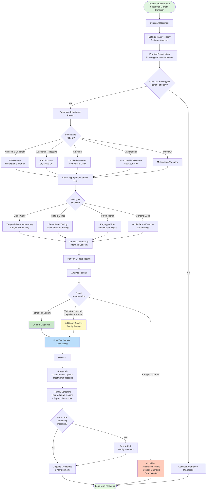

```mermaid
flowchart TD
    Start([Patient Presents with<br/>Suspected Genetic Condition]) --> A[Clinical Assessment]
    
    A --> B[Detailed Family History<br/>Pedigree Analysis]
    B --> C[Physical Examination<br/>Phenotype Characterization]
    
    C --> D{Does pattern suggest<br/>genetic etiology?}
    D -->|No| E[Consider Alternative Diagnoses]
    D -->|Yes| F[Determine Inheritance Pattern]
    
    F --> G{Inheritance<br/>Pattern?}
    G -->|Autosomal Dominant| H[AD Disorders<br/>Huntington's, Marfan]
    G -->|Autosomal Recessive| I[AR Disorders<br/>CF, Sickle Cell]
    G -->|X-Linked| J[X-Linked Disorders<br/>Hemophilia, DMD]
    G -->|Mitochondrial| K[Mitochondrial Disorders<br/>MELAS, LHON]
    G -->|Unknown| L[Multifactorial/Complex]
    
    H --> M[Select Appropriate Genetic Test]
    I --> M
    J --> M
    K --> M
    L --> M
    
    M --> N{Test Type<br/>Selection}
    N -->|Single Gene| O[Targeted Gene Sequencing<br/>Sanger Sequencing]
    N -->|Multiple Genes| P[Gene Panel Testing<br/>Next-Gen Sequencing]
    N -->|Chromosomal| Q[Karyotype/FISH<br/>Microarray Analysis]
    N -->|Genome-Wide| R[Whole Exome/Genome<br/>Sequencing]
    
    O --> S[Genetic Counseling<br/>Informed Consent]
    P --> S
    Q --> S
    R --> S
    
    S --> T[Perform Genetic Testing]
    T --> U[Analyze Results]
    
    U --> V{Result<br/>Interpretation}
    V -->|Pathogenic Variant| W[Confirm Diagnosis]
    V -->|Variant of Uncertain<br/>Significance VUS| X[Additional Studies<br/>Family Testing]
    V -->|Benign/No Variant| Y[Consider:<br/>- Alternative Testing<br/>- Clinical Diagnosis<br/>- Re-evaluation]
    
    W --> Z[Post-Test Genetic Counseling]
    X --> Z
    
    Z --> AA[Discuss:]
    AA --> AB[- Prognosis<br/>- Management Options<br/>- Treatment Strategies]
    AB --> AC[- Family Screening<br/>- Reproductive Options<br/>- Support Resources]
    
    AC --> AD{Is cascade<br/>screening<br/>indicated?}
    AD -->|Yes| AE[Test At-Risk<br/>Family Members]
    AD -->|No| AF[Ongoing Monitoring<br/>& Management]
    
    AE --> AF
    AF --> AG([Long-term Follow-up])
    Y --> AG
    E --> AG
    
    style Start fill:#e1f5e1
    style AG fill:#e1f5e1
    style W fill:#c8e6c9
    style X fill:#fff9c4
    style Y fill:#ffccbc
    style Z fill:#bbdefb
```
