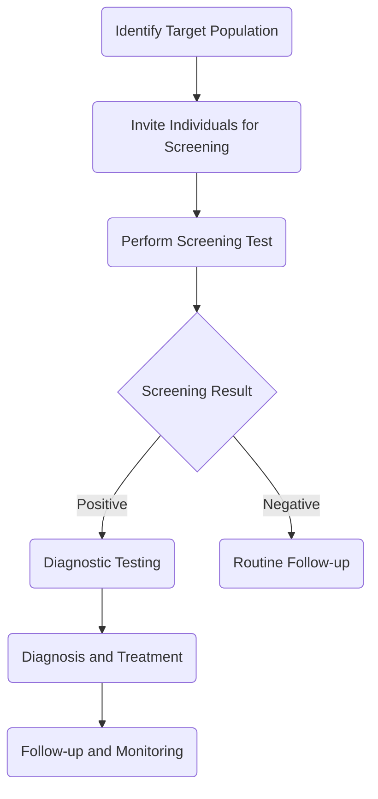

```mermaid
flowchart TD
    A(Identify Target Population) --> B(Invite Individuals for Screening);
    B --> C(Perform Screening Test);
    C --> D{Screening Result};
    D -- Positive --> E(Diagnostic Testing);
    D -- Negative --> F(Routine Follow-up);
    E --> G(Diagnosis and Treatment);
    G --> H(Follow-up and Monitoring);
```
