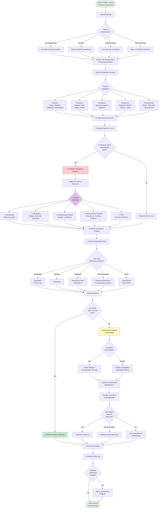

```mermaid
flowchart TD
    Start([Worker Health Concern<br/>or Routine Assessment]) --> A[Initial Evaluation]
    
    A --> B{Type of<br/>Assessment?}
    B -->|Pre-employment| C[Pre-placement Examination]
    B -->|Periodic| D[Routine Health Surveillance]
    B -->|Incident-related| E[Post-exposure Evaluation]
    B -->|Fitness for duty| F[Return-to-Work Assessment]
    
    C --> G[Review Job Requirements<br/>& Physical Demands]
    D --> G
    E --> G
    F --> G
    
    G --> H[Identify Workplace Hazards]
    H --> I{Hazard<br/>Categories}
    
    I --> J[Physical:<br/>Noise, Vibration,<br/>Radiation, Temperature]
    I --> K[Chemical:<br/>Solvents, Dust,<br/>Fumes, Toxins]
    I --> L[Biological:<br/>Infectious Agents,<br/>Allergens]
    I --> M[Ergonomic:<br/>Repetitive Motion,<br/>Posture, Lifting]
    I --> N[Psychosocial:<br/>Stress, Shift Work,<br/>Violence Risk]
    
    J --> O[Conduct Risk Assessment]
    K --> O
    L --> O
    M --> O
    N --> O
    
    O --> P[Evaluate Exposure Level]
    P --> Q{Is exposure above<br/>occupational<br/>limits?}
    
    Q -->|Yes| R[Immediate Intervention Required]
    Q -->|No| S[Determine Risk Level]
    
    R --> T[Implement Control Measures]
    T --> U{Control<br/>Hierarchy}
    
    U --> V[1. Elimination<br/>Remove hazard]
    U --> W[2. Substitution<br/>Replace with safer alternative]
    U --> X[3. Engineering Controls<br/>Isolation, Ventilation]
    U --> Y[4. Administrative Controls<br/>Procedures, Training, Rotation]
    U --> Z[5. PPE<br/>Last line of defense]
    
    V --> AA[Medical Surveillance Program]
    W --> AA
    X --> AA
    Y --> AA
    Z --> AA
    S --> AA
    
    AA --> AB[Conduct Appropriate Tests]
    AB --> AC{Test Type<br/>Based on Exposure}
    
    AC -->|Respiratory| AD[Spirometry<br/>Chest X-ray]
    AC -->|Hearing| AE[Audiometry]
    AC -->|Biological| AF[Blood/Urine Tests<br/>Biomarkers]
    AC -->|Musculoskeletal| AG[Physical Examination<br/>Functional Assessment]
    AC -->|Vision| AH[Visual Acuity<br/>Color Vision]
    
    AD --> AI[Interpret Results]
    AE --> AI
    AF --> AI
    AG --> AI
    AH --> AI
    
    AI --> AJ{Are results<br/>within normal<br/>limits?}
    
    AJ -->|Yes| AK[Fitness for Work Confirmed]
    AJ -->|No| AL[Identify Work-Related<br/>Health Effect]
    
    AL --> AM{Is condition<br/>work-related?}
    AM -->|Yes| AN[Initiate Workers'<br/>Compensation Process]
    AM -->|Unclear| AO[Further Investigation<br/>Specialist Referral]
    
    AN --> AP[Implement Workplace<br/>Modifications]
    AO --> AP
    
    AP --> AQ[Provide Treatment<br/>& Rehabilitation]
    AQ --> AR{Can worker<br/>return to<br/>same job?}
    
    AR -->|Yes| AS[Full Duty Clearance]
    AR -->|With restrictions| AT[Modified Duty Assignment]
    AR -->|No| AU[Job Reassignment<br/>or Retraining]
    
    AK --> AV[Document Findings]
    AS --> AV
    AT --> AV
    AU --> AV
    
    AV --> AW[Schedule Follow-up]
    AW --> AX{Ongoing<br/>monitoring<br/>needed?}
    
    AX -->|Yes| AY[Add to Surveillance<br/>Program]
    AX -->|No| AZ([Case Closed<br/>Routine Review])
    
    AY --> AZ
    
    style Start fill:#e1f5e1
    style AZ fill:#e1f5e1
    style R fill:#ffcdd2
    style AK fill:#c8e6c9
    style AL fill:#fff9c4
    style U fill:#e1bee7
```
