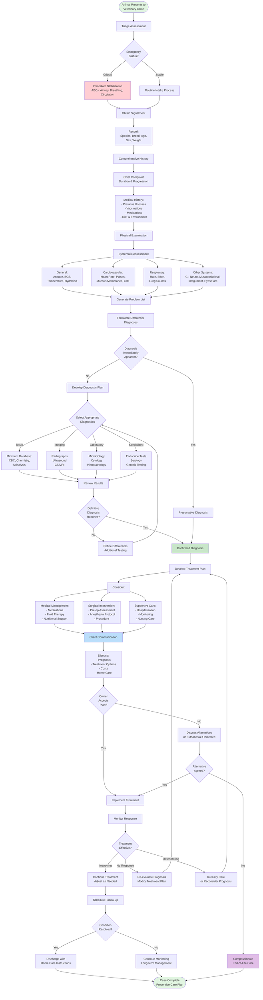

```mermaid
flowchart TD
    Start([Animal Presents to<br/>Veterinary Clinic]) --> A[Triage Assessment]
    
    A --> B{Emergency<br/>Status?}
    B -->|Critical| C[Immediate Stabilization<br/>ABCs: Airway, Breathing, Circulation]
    B -->|Stable| D[Routine Intake Process]
    
    C --> E[Obtain Signalment]
    D --> E
    
    E --> F[Record:<br/>Species, Breed, Age,<br/>Sex, Weight]
    F --> G[Comprehensive History]
    
    G --> H[Chief Complaint<br/>Duration & Progression]
    H --> I[Medical History:<br/>- Previous Illnesses<br/>- Vaccinations<br/>- Medications<br/>- Diet & Environment]
    
    I --> J[Physical Examination]
    J --> K[Systematic Assessment]
    
    K --> L[General:<br/>Attitude, BCS,<br/>Temperature, Hydration]
    K --> M[Cardiovascular:<br/>Heart Rate, Pulses,<br/>Mucous Membranes, CRT]
    K --> N[Respiratory:<br/>Rate, Effort,<br/>Lung Sounds]
    K --> O[Other Systems:<br/>GI, Neuro, Musculoskeletal,<br/>Integument, Eyes/Ears]
    
    L --> P[Generate Problem List]
    M --> P
    N --> P
    O --> P
    
    P --> Q[Formulate Differential Diagnoses]
    Q --> R{Diagnosis<br/>Immediately<br/>Apparent?}
    
    R -->|Yes| S[Presumptive Diagnosis]
    R -->|No| T[Develop Diagnostic Plan]
    
    T --> U{Select Appropriate<br/>Diagnostics}
    U -->|Basic| V[Minimum Database:<br/>CBC, Chemistry,<br/>Urinalysis]
    U -->|Imaging| W[Radiographs<br/>Ultrasound<br/>CT/MRI]
    U -->|Laboratory| X[Microbiology<br/>Cytology<br/>Histopathology]
    U -->|Specialized| Y[Endocrine Tests<br/>Serology<br/>Genetic Testing]
    
    V --> Z[Review Results]
    W --> Z
    X --> Z
    Y --> Z
    
    Z --> AA{Definitive<br/>Diagnosis<br/>Reached?}
    AA -->|No| AB[Refine Differentials<br/>Additional Testing]
    AA -->|Yes| AC[Confirmed Diagnosis]
    
    AB --> U
    S --> AC
    
    AC --> AD[Develop Treatment Plan]
    AD --> AE[Consider:]
    
    AE --> AF[Medical Management:<br/>- Medications<br/>- Fluid Therapy<br/>- Nutritional Support]
    AE --> AG[Surgical Intervention:<br/>- Pre-op Assessment<br/>- Anesthesia Protocol<br/>- Procedure]
    AE --> AH[Supportive Care:<br/>- Hospitalization<br/>- Monitoring<br/>- Nursing Care]
    
    AF --> AI[Client Communication]
    AG --> AI
    AH --> AI
    
    AI --> AJ[Discuss:<br/>- Prognosis<br/>- Treatment Options<br/>- Costs<br/>- Home Care]
    
    AJ --> AK{Owner<br/>Accepts<br/>Plan?}
    AK -->|No| AL[Discuss Alternatives<br/>or Euthanasia if Indicated]
    AK -->|Yes| AM[Implement Treatment]
    
    AL --> AN{Alternative<br/>Agreed?}
    AN -->|Yes| AM
    AN -->|No| AO[Compassionate<br/>End-of-Life Care]
    
    AM --> AP[Monitor Response]
    AP --> AQ{Treatment<br/>Effective?}
    
    AQ -->|Improving| AR[Continue Treatment<br/>Adjust as Needed]
    AQ -->|No Response| AS[Re-evaluate Diagnosis<br/>Modify Treatment Plan]
    AQ -->|Deteriorating| AT[Intensify Care<br/>or Reconsider Prognosis]
    
    AS --> AD
    AT --> AD
    
    AR --> AU[Schedule Follow-up]
    AU --> AV{Condition<br/>Resolved?}
    
    AV -->|Yes| AW[Discharge with<br/>Home Care Instructions]
    AV -->|No| AX[Continue Monitoring<br/>Long-term Management]
    
    AW --> AY([Case Complete<br/>Preventive Care Plan])
    AX --> AY
    AO --> AY
    
    style Start fill:#e1f5e1
    style AY fill:#e1f5e1
    style C fill:#ffcdd2
    style AC fill:#c8e6c9
    style AO fill:#e1bee7
    style AI fill:#bbdefb
```
