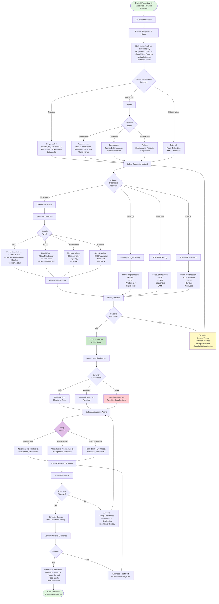

```mermaid
flowchart TD
    Start([Patient Presents with<br/>Suspected Parasitic Infection]) --> A[Clinical Assessment]
    
    A --> B[Review Symptoms & History]
    B --> C[Risk Factor Analysis:<br/>- Travel History<br/>- Exposure to Vectors<br/>- Food/Water Sources<br/>- Animal Contact<br/>- Immune Status]
    
    C --> D{Determine Parasite<br/>Category}
    
    D -->|Protozoa| E[Single-celled:<br/>Giardia, Cryptosporidium,<br/>Plasmodium, Toxoplasma,<br/>Entamoeba]
    D -->|Helminths| F[Worms]
    D -->|Ectoparasites| G[External:<br/>Fleas, Ticks, Lice,<br/>Mites, Bed Bugs]
    
    F --> H{Helminth<br/>Type?}
    H -->|Nematodes| I[Roundworms:<br/>Ascaris, Hookworms,<br/>Pinworms, Trichinella,<br/>Filarial worms]
    H -->|Cestodes| J[Tapeworms:<br/>Taenia, Echinococcus,<br/>Diphyllobothrium]
    H -->|Trematodes| K[Flukes:<br/>Schistosoma, Fasciola,<br/>Paragonimus]
    
    E --> L[Select Diagnostic Method]
    I --> L
    J --> L
    K --> L
    G --> L
    
    L --> M{Primary<br/>Diagnostic<br/>Approach}
    
    M -->|Microscopy| N[Direct Examination]
    M -->|Serology| O[Antibody/Antigen Testing]
    M -->|Molecular| P[PCR/DNA Testing]
    M -->|Clinical| Q[Physical Examination]
    
    N --> R[Specimen Collection]
    R --> S{Sample<br/>Type?}
    
    S -->|Stool| T[Fecal Examination:<br/>- Direct Smear<br/>- Concentration Methods<br/>- Flotation<br/>- Trichrome Stain]
    S -->|Blood| U[Blood Film:<br/>- Thick/Thin Smear<br/>- Giemsa Stain<br/>- Microfilaria Detection]
    S -->|Tissue/Fluid| V[Biopsy/Aspirate:<br/>- Histopathology<br/>- Cytology<br/>- Culture]
    S -->|Skin/Hair| W[Skin Scraping:<br/>- KOH Preparation<br/>- Tape Test<br/>- Hair Pluck]
    
    T --> X[Microscopic Analysis]
    U --> X
    V --> X
    W --> X
    
    O --> Y[Immunological Tests:<br/>- ELISA<br/>- IFA<br/>- Western Blot<br/>- Rapid Tests]
    
    P --> Z[Molecular Methods:<br/>- PCR<br/>- qPCR<br/>- Sequencing<br/>- LAMP]
    
    Q --> AA[Visual Identification:<br/>- Adult Parasites<br/>- Lesions<br/>- Burrows<br/>- Nits/Eggs]
    
    X --> AB[Identify Parasite]
    Y --> AB
    Z --> AB
    AA --> AB
    
    AB --> AC{Parasite<br/>Identified?}
    
    AC -->|Yes| AD[Confirm Species<br/>& Life Stage]
    AC -->|No| AE[Consider:<br/>- Repeat Testing<br/>- Different Method<br/>- Multiple Samples<br/>- Specialist Consultation]
    
    AE --> L
    
    AD --> AF[Assess Infection Burden]
    AF --> AG{Severity<br/>Assessment}
    
    AG -->|Light| AH[Mild Infection<br/>Monitor or Treat]
    AG -->|Moderate| AI[Standard Treatment<br/>Required]
    AG -->|Heavy| AJ[Intensive Treatment<br/>Possible Complications]
    
    AH --> AK[Select Antiparasitic Agent]
    AI --> AK
    AJ --> AK
    
    AK --> AL{Drug<br/>Selection}
    
    AL -->|Antiprotozoal| AM[Metronidazole, Tinidazole,<br/>Nitazoxanide, Artemisinin]
    AL -->|Antihelminthic| AN[Albendazole, Mebendazole,<br/>Praziquantel, Ivermectin]
    AL -->|Ectoparasiticide| AO[Permethrin, Pyrethroids,<br/>Malathion, Ivermectin]
    
    AM --> AP[Initiate Treatment Protocol]
    AN --> AP
    AO --> AP
    
    AP --> AQ[Monitor Response]
    AQ --> AR{Treatment<br/>Effective?}
    
    AR -->|Yes| AS[Complete Course<br/>Post-Treatment Testing]
    AR -->|No| AT[Assess:<br/>- Drug Resistance<br/>- Compliance<br/>- Reinfection<br/>- Alternative Therapy]
    
    AT --> AK
    
    AS --> AU[Confirm Parasite Clearance]
    AU --> AV{Cleared?}
    
    AV -->|Yes| AW[Prevention Education:<br/>- Hygiene Measures<br/>- Vector Control<br/>- Food Safety<br/>- Pet Treatment]
    AV -->|No| AX[Extended Treatment<br/>or Alternative Regimen]
    
    AX --> AP
    
    AW --> AY([Case Resolved<br/>Follow-up as Needed])
    
    style Start fill:#e1f5e1
    style AY fill:#e1f5e1
    style AD fill:#c8e6c9
    style AJ fill:#ffcdd2
    style AE fill:#fff9c4
    style AL fill:#e1bee7
```
