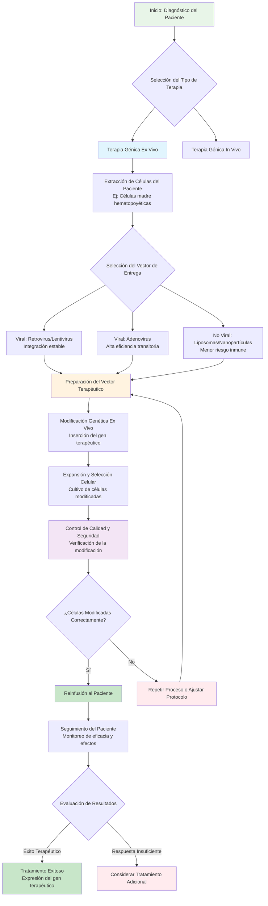

```mermaid
flowchart TD
    A[Inicio: Diagnóstico del Paciente] --> B{Selección del Tipo de Terapia}
    
    B --> C[Terapia Génica Ex Vivo]
    B --> D[Terapia Génica In Vivo]
    
    C --> E[Extracción de Células del Paciente<br>Ej: Células madre hematopoyéticas]
    
    E --> F{Selección del Vector de Entrega}
    
    F --> G[Viral: Retrovirus/Lentivirus<br>Integración estable]
    F --> H[Viral: Adenovirus<br>Alta eficiencia transitoria]
    F --> I[No Viral: Liposomas/Nanopartículas<br>Menor riesgo inmune]
    
    G --> J[Preparación del Vector Terapéutico]
    H --> J
    I --> J
    
    J --> K[Modificación Genética Ex Vivo<br>Inserción del gen terapéutico]
    
    K --> L[Expansión y Selección Celular<br>Cultivo de células modificadas]
    
    L --> M[Control de Calidad y Seguridad<br>Verificación de la modificación]
    
    M --> N{¿Células Modificadas Correctamente?}
    N -->|Sí| O[Reinfusión al Paciente]
    N -->|No| P[Repetir Proceso o Ajustar Protocolo]
    
    O --> Q[Seguimiento del Paciente<br>Monitoreo de eficacia y efectos]
    
    Q --> R{Evaluación de Resultados}
    R -->|Éxito Terapéutico| S[Tratamiento Exitoso<br>Expresión del gen terapéutico]
    R -->|Respuesta Insuficiente| T[Considerar Tratamiento Adicional]
    
    P --> J
    
    style A fill:#e8f5e8
    style C fill:#e1f5fe
    style O fill:#c8e6c9
    style S fill:#c8e6c9
    style J fill:#fff3e0
    style M fill:#f3e5f5
    style P fill:#ffebee
    style T fill:#ffebee
```
