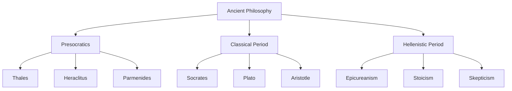

```mermaid
flowchart TD
    AP[Ancient Philosophy] --> P[Presocratics]
    AP --> C[Classical Period]
    AP --> H[Hellenistic Period]

    P --> T[Thales]
    P --> H2[Heraclitus]
    P --> P2[Parmenides]

    C --> S[Socrates]
    C --> P3[Plato]
    C --> A[Aristotle]

    H --> E[Epicureanism]
    H --> S2[Stoicism]
    H --> S3[Skepticism]
```
