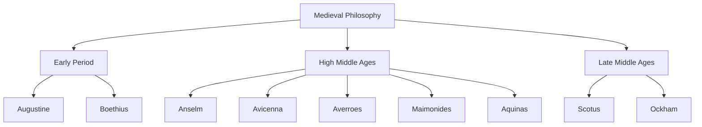

```mermaid
flowchart TD
    MP[Medieval Philosophy] --> E[Early Period]
    MP --> H[High Middle Ages]
    MP --> L[Late Middle Ages]

    E --> A[Augustine]
    E --> B[Boethius]

    H --> A2[Anselm]
    H --> A3[Avicenna]
    H --> A4[Averroes]
    H --> M[Maimonides]
    H --> A5[Aquinas]

    L --> S[Scotus]
    L --> O[Ockham]
```
