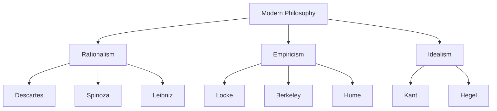

```mermaid
flowchart TD
    MP[Modern Philosophy] --> R[Rationalism]
    MP --> E[Empiricism]
    MP --> I[Idealism]

    R --> D[Descartes]
    R --> S[Spinoza]
    R --> L[Leibniz]

    E --> L2[Locke]
    E --> B[Berkeley]
    E --> H[Hume]

    I --> K[Kant]
    I --> H2[Hegel]
```
