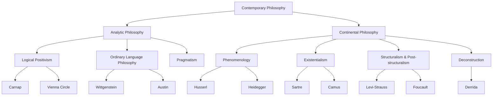

```mermaid
flowchart TD
    CP[Contemporary Philosophy] --> A[Analytic Philosophy]
    CP --> C[Continental Philosophy]

    A --> L[Logical Positivism]
    A --> O[Ordinary Language Philosophy]
    A --> P[Pragmatism]

    L --> C2[Carnap]
    L --> V[Vienna Circle]

    O --> W[Wittgenstein]
    O --> A2[Austin]

    C --> P2[Phenomenology]
    C --> E[Existentialism]
    C --> S[Structuralism & Post-structuralism]
    C --> D[Deconstruction]

    P2 --> H[Husserl]
    P2 --> H2[Heidegger]

    E --> S2[Sartre]
    E --> C3[Camus]

    S --> L2[Levi-Strauss]
    S --> F[Foucault]

    D --> D2[Derrida]
```
