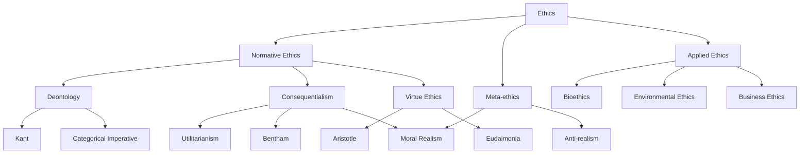

```mermaid
flowchart TD
    E[Ethics] --> N[Normative Ethics]
    E --> M[Meta-ethics]
    E --> A[Applied Ethics]

    N --> D[Deontology]
    N --> C[Consequentialism]
    N --> V[Virtue Ethics]

    D --> K[Kant]
    D --> CI[Categorical Imperative]

    C --> U[Utilitarianism]
    C --> B[Bentham]
    C --> M2[Mill]

    V --> A2[Aristotle]
    V --> E2[Eudaimonia]

    M --> M2[Moral Realism]
    M --> A3[Anti-realism]

    A --> B2[Bioethics]
    A --> E3[Environmental Ethics]
    A --> B3[Business Ethics]
```
