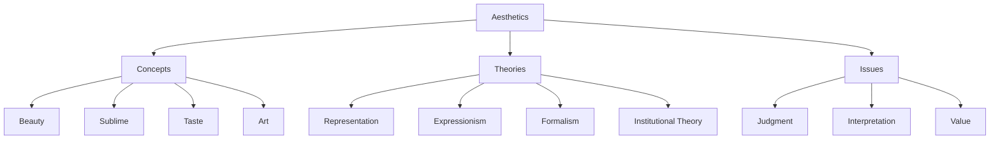

```mermaid
flowchart TD
    A[Aesthetics] --> C[Concepts]
    A --> T[Theories]
    A --> I[Issues]

    C --> B[Beauty]
    C --> S[Sublime]
    C --> T2[Taste]
    C --> A2[Art]

    T --> R[Representation]
    T --> E[Expressionism]
    T --> F[Formalism]
    T --> I2[Institutional Theory]

    I --> J[Judgment]
    I --> I3[Interpretation]
    I --> V[Value]
```
