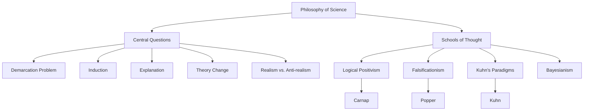

```mermaid
flowchart TD
    PS[Philosophy of Science] --> C[Central Questions]
    PS --> S[Schools of Thought]

    C --> D[Demarcation Problem]
    C --> I[Induction]
    C --> E[Explanation]
    C --> T[Theory Change]
    C --> R[Realism vs. Anti-realism]

    S --> L[Logical Positivism]
    S --> P[Falsificationism]
    S --> K[Kuhn's Paradigms]
    S --> B[Bayesianism]

    L --> C2[Carnap]
    P --> P2[Popper]
    K --> K2[Kuhn]
```
