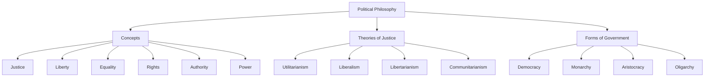

```mermaid
flowchart TD
    PP[Political Philosophy] --> C[Concepts]
    PP --> T[Theories of Justice]
    PP --> F[Forms of Government]

    C --> J[Justice]
    C --> L[Liberty]
    C --> E[Equality]
    C --> R[Rights]
    C --> A[Authority]
    C --> P[Power]

    T --> U[Utilitarianism]
    T --> L2[Liberalism]
    T --> L3[Libertarianism]
    T --> C2[Communitarianism]

    F --> D[Democracy]
    F --> M[Monarchy]
    F --> A2[Aristocracy]
    F --> O[Oligarchy]
```
