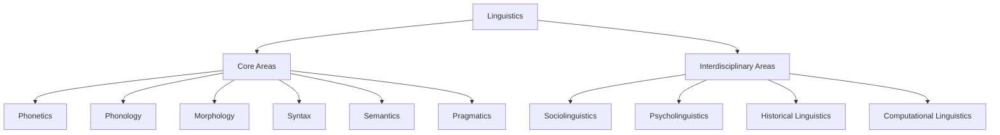

```mermaid
flowchart TD
    L[Linguistics] --> C[Core Areas]
    L --> I[Interdisciplinary Areas]

    C --> P[Phonetics]
    C --> P2[Phonology]
    C --> M[Morphology]
    C --> S[Syntax]
    C --> S2[Semantics]
    C --> P3[Pragmatics]

    I --> S3[Sociolinguistics]
    I --> P4[Psycholinguistics]
    I --> H[Historical Linguistics]
    I --> C2[Computational Linguistics]
```
