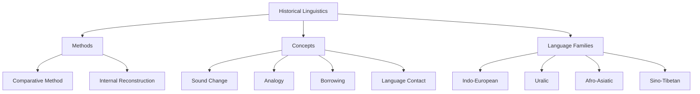

```mermaid
flowchart TD
    HL[Historical Linguistics] --> M[Methods]
    HL --> C[Concepts]
    HL --> F[Language Families]

    M --> C2[Comparative Method]
    M --> I[Internal Reconstruction]

    C --> S[Sound Change]
    C --> A[Analogy]
    C --> B[Borrowing]
    C --> L[Language Contact]

    F --> IE[Indo-European]
    F --> U[Uralic]
    F --> AA[Afro-Asiatic]
    F --> S2[Sino-Tibetan]
```
