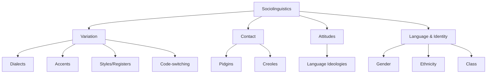

```mermaid
flowchart TD
    S[Sociolinguistics] --> V[Variation]
    S --> C[Contact]
    S --> A[Attitudes]
    S --> L[Language & Identity]

    V --> D[Dialects]
    V --> A2[Accents]
    V --> S2[Styles/Registers]
    V --> C2[Code-switching]

    C --> P[Pidgins]
    C --> C3[Creoles]

    A --> L2[Language Ideologies]

    L --> G[Gender]
    L --> E[Ethnicity]
    L --> C4[Class]
```
