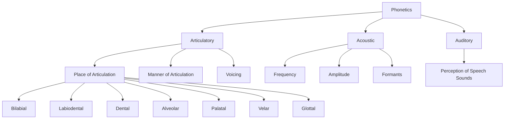

```mermaid
flowchart TD
    P[Phonetics] --> A[Articulatory]
    P --> A2[Acoustic]
    P --> A3[Auditory]

    A --> P2[Place of Articulation]
    A --> M[Manner of Articulation]
    A --> V[Voicing]

    P2 --> B[Bilabial]
    P2 --> L[Labiodental]
    P2 --> D[Dental]
    P2 --> A4[Alveolar]
    P2 --> P3[Palatal]
    P2 --> V2[Velar]
    P2 --> G[Glottal]

    A2 --> F[Frequency]
    A2 --> A5[Amplitude]
    A2 --> F2[Formants]

    A3 --> P4[Perception of Speech Sounds]
```
