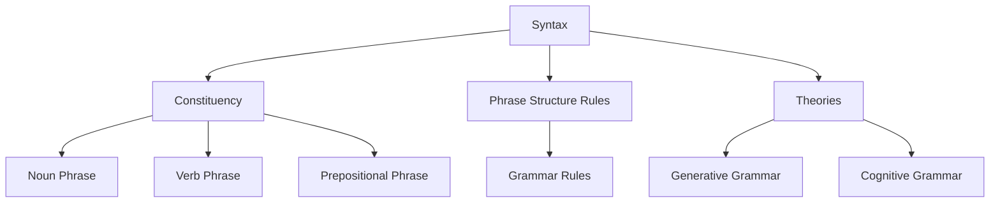

```mermaid
flowchart TD
    Syntax[Syntax] --> Constituency[Constituency]
    Syntax --> PhraseStructure[Phrase Structure Rules]
    Syntax --> Theories[Theories]
    Constituency --> NP[Noun Phrase]
    Constituency --> VP[Verb Phrase]
    Constituency --> PP[Prepositional Phrase]
    PhraseStructure --> Rules[Grammar Rules]
    Theories --> Generative[Generative Grammar]
    Theories --> Cognitive[Cognitive Grammar]
```