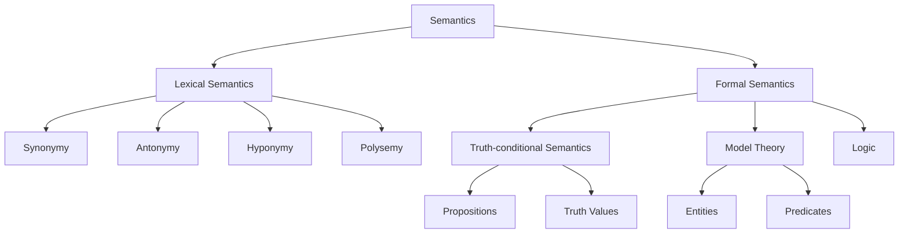

```mermaid
flowchart TD
    S[Semantics] --> L[Lexical Semantics]
    S --> F[Formal Semantics]

    L --> S2[Synonymy]
    L --> A[Antonymy]
    L --> H[Hyponymy]
    L --> P[Polysemy]

    F --> T[Truth-conditional Semantics]
    F --> M[Model Theory]
    F --> L2[Logic]

    T --> P2[Propositions]
    T --> T2[Truth Values]

    M --> E[Entities]
    M --> P3[Predicates]
```
