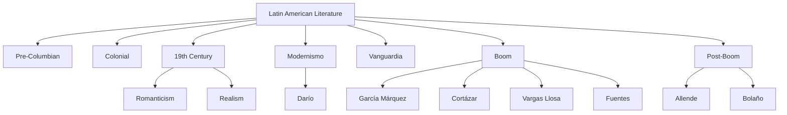

```mermaid
flowchart TD
    LAL[Latin American Literature] --> P[Pre-Columbian]
    LAL --> C[Colonial]
    LAL --> N[19th Century]
    LAL --> M[Modernismo]
    LAL --> V[Vanguardia]
    LAL --> B[Boom]
    LAL --> PB[Post-Boom]

    N --> R[Romanticism]
    N --> R2[Realism]

    M --> D[Darío]

    B --> G[García Márquez]
    B --> C2[Cortázar]
    B --> V2[Vargas Llosa]
    B --> F[Fuentes]

    PB --> A[Allende]
    PB --> B2[Bolaño]
```
