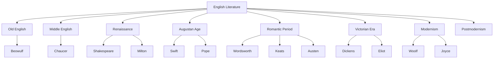

```mermaid
flowchart TD
    EL[English Literature] --> O[Old English]
    EL --> M[Middle English]
    EL --> R[Renaissance]
    EL --> A[Augustan Age]
    EL --> R2[Romantic Period]
    EL --> V[Victorian Era]
    EL --> M2[Modernism]
    EL --> P[Postmodernism]

    O --> B[Beowulf]

    M --> C[Chaucer]

    R --> S[Shakespeare]
    R --> M3[Milton]

    A --> S2[Swift]
    A --> P2[Pope]

    R2 --> W[Wordsworth]
    R2 --> K[Keats]
    R2 --> A2[Austen]

    V --> D[Dickens]
    V --> E[Eliot]

    M2 --> W2[Woolf]
    M2 --> J[Joyce]
```
