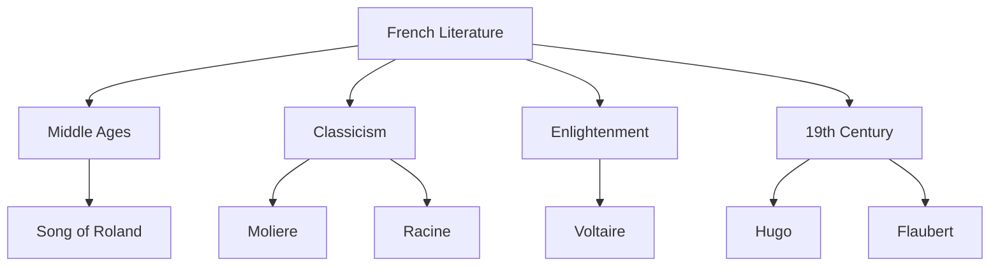

```mermaid
flowchart TD
    FrenchLiterature[French Literature] --> MiddleAges[Middle Ages]
    FrenchLiterature --> Classicism[Classicism]
    FrenchLiterature --> Enlightenment[Enlightenment]
    FrenchLiterature --> Nineteenth[19th Century]
    MiddleAges --> SongOfRoland[Song of Roland]
    Classicism --> Moliere[Moliere]
    Classicism --> Racine[Racine]
    Enlightenment --> Voltaire[Voltaire]
    Nineteenth --> Hugo[Hugo]
    Nineteenth --> Flaubert[Flaubert]
```