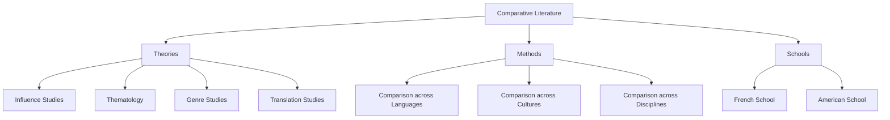

```mermaid
flowchart TD
    CL[Comparative Literature] --> T[Theories]
    CL --> M[Methods]
    CL --> S[Schools]

    T --> I[Influence Studies]
    T --> T2[Thematology]
    T --> G[Genre Studies]
    T --> T3[Translation Studies]

    M --> C[Comparison across Languages]
    M --> C2[Comparison across Cultures]
    M --> C3[Comparison across Disciplines]

    S --> F[French School]
    S --> A[American School]
```
