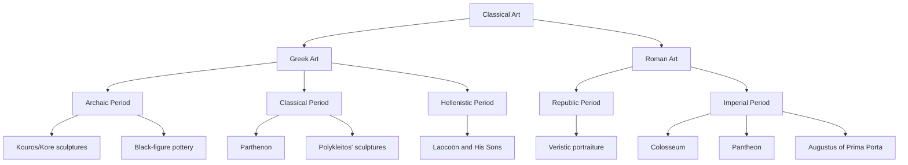

```mermaid
flowchart TD
    CA[Classical Art] --> G[Greek Art]
    CA --> R[Roman Art]

    G --> A[Archaic Period]
    G --> C[Classical Period]
    G --> H[Hellenistic Period]

    A --> K[Kouros/Kore sculptures]
    A --> B[Black-figure pottery]

    C --> P[Parthenon]
    C --> P2[Polykleitos' sculptures]

    H --> L[Laocoön and His Sons]

    R --> R2[Republic Period]
    R --> I[Imperial Period]

    R2 --> V[Veristic portraiture]

    I --> C2[Colosseum]
    I --> P3[Pantheon]
    I --> A2[Augustus of Prima Porta]
```
