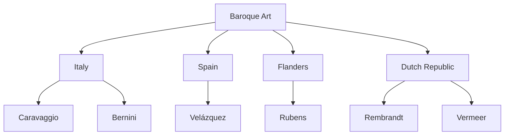

```mermaid
flowchart TD
    BA[Baroque Art] --> I[Italy]
    BA --> S[Spain]
    BA --> F[Flanders]
    BA --> D[Dutch Republic]

    I --> C[Caravaggio]
    I --> B[Bernini]

    S --> V[Velázquez]

    F --> R[Rubens]

    D --> R2[Rembrandt]
    D --> V2[Vermeer]
```
