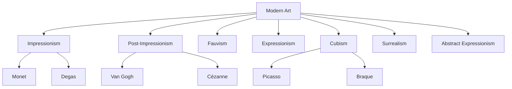

```mermaid
flowchart TD
    MA[Modern Art] --> I[Impressionism]
    MA --> P[Post-Impressionism]
    MA --> F[Fauvism]
    MA --> E[Expressionism]
    MA --> C[Cubism]
    MA --> S[Surrealism]
    MA --> A[Abstract Expressionism]

    I --> M[Monet]
    I --> D[Degas]

    P --> V[Van Gogh]
    P --> C2[Cézanne]

    C --> P2[Picasso]
    C --> B[Braque]
```
