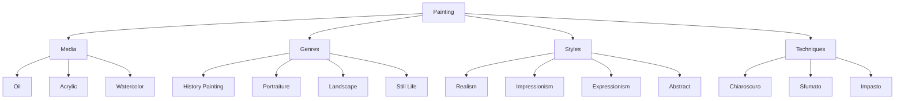

```mermaid
flowchart TD
    P[Painting] --> M[Media]
    P --> G[Genres]
    P --> S[Styles]
    P --> T[Techniques]

    M --> O[Oil]
    M --> A[Acrylic]
    M --> W[Watercolor]

    G --> H[History Painting]
    G --> P2[Portraiture]
    G --> L[Landscape]
    G --> S2[Still Life]

    S --> R[Realism]
    S --> I[Impressionism]
    S --> E[Expressionism]
    S --> A2[Abstract]

    T --> C[Chiaroscuro]
    T --> S3[Sfumato]
    T --> I2[Impasto]
```
