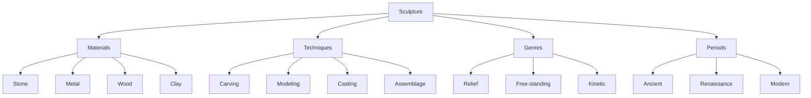

```mermaid
flowchart TD
    S[Sculpture] --> M[Materials]
    S --> T[Techniques]
    S --> G[Genres]
    S --> P[Periods]

    M --> S2[Stone]
    M --> M2[Metal]
    M --> W[Wood]
    M --> C[Clay]

    T --> C2[Carving]
    T --> M3[Modeling]
    T --> C3[Casting]
    T --> A[Assemblage]

    G --> R[Relief]
    G --> FS[Free-standing]
    G --> K[Kinetic]

    P --> A2[Ancient]
    P --> R2[Renaissance]
    P --> M4[Modern]
```
