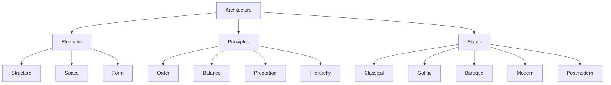

```mermaid
flowchart TD
    A[Architecture] --> E[Elements]
    A --> P[Principles]
    A --> S[Styles]

    E --> S2[Structure]
    E --> S3[Space]
    E --> F[Form]

    P --> O[Order]
    P --> B[Balance]
    P --> P2[Proportion]
    P --> H[Hierarchy]

    S --> C[Classical]
    S --> G[Gothic]
    S --> B2[Baroque]
    S --> M[Modern]
    S --> P3[Postmodern]
```
