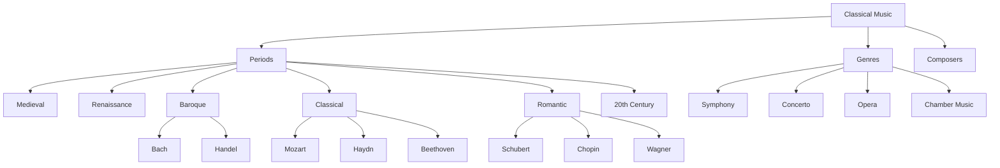

```mermaid
flowchart TD
    CM[Classical Music] --> P[Periods]
    CM --> G[Genres]
    CM --> C[Composers]

    P --> M[Medieval]
    P --> R[Renaissance]
    P --> B[Baroque]
    P --> C2[Classical]
    P --> R2[Romantic]
    P --> T[20th Century]

    G --> S[Symphony]
    G --> C3[Concerto]
    G --> O[Opera]
    G --> C4[Chamber Music]

    B --> B2[Bach]
    B --> H[Handel]

    C2 --> M2[Mozart]
    C2 --> H2[Haydn]
    C2 --> B3[Beethoven]

    R2 --> S2[Schubert]
    R2 --> C5[Chopin]
    R2 --> W[Wagner]
```
