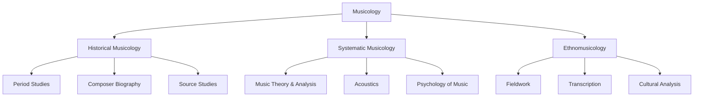

```mermaid
flowchart TD
    M[Musicology] --> H[Historical Musicology]
    M --> S[Systematic Musicology]
    M --> E[Ethnomusicology]

    H --> P[Period Studies]
    H --> B[Composer Biography]
    H --> S2[Source Studies]

    S --> MT[Music Theory & Analysis]
    S --> A[Acoustics]
    S --> P2[Psychology of Music]

    E --> FT[Fieldwork]
    E --> T[Transcription]
    E --> CA[Cultural Analysis]
```
