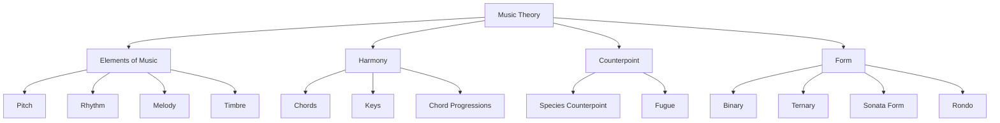

```mermaid
flowchart TD
    MT[Music Theory] --> E[Elements of Music]
    MT --> H[Harmony]
    MT --> C[Counterpoint]
    MT --> F[Form]

    E --> P[Pitch]
    E --> R[Rhythm]
    E --> M[Melody]
    E --> T[Timbre]

    H --> C2[Chords]
    H --> K[Keys]
    H --> CP[Chord Progressions]

    C --> S[Species Counterpoint]
    C --> F2[Fugue]

    F --> B[Binary]
    F --> T2[Ternary]
    F --> S2[Sonata Form]
    F --> R2[Rondo]
```
